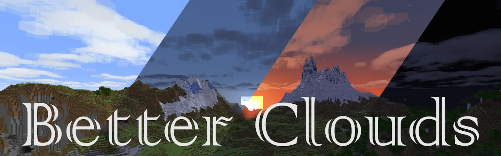

# 

> *"Beautiful clouds in touch with the vanilla style"*

![Mod loader: Fabric](https://img.shields.io/badge/modloader-Fabric-1976d2?style=flat-square&logo=)

[![modrinth](https://img.shields.io/badge/modrinth--brightgreen?color=5da545&%20&query=downloads&style=flat-square&logo=)](https://modrinth.com/mod/better-clouds)

**Please, feel free to [report](https://github.com/Qendolin/better-clouds/issues/new) any issues**

> hi everyone, i'm the new maintainer now. the mod is no longer discontinued. cheers  
> -orangishcat

---

**Better Clouds** replaces Minecraft's flat cloud layer with volumetric skies that still feel at home in vanilla. The
goal is simple: make the sky look dramatically better without drifting into a style that clashes with the rest of the
game.

### Features

- **Vanilla-friendly volumetric clouds:** Adds layered, sculpted cloud formations that preserve Minecraft's overall look
  instead of replacing it with hyper-realistic skies.
- **Deep visual customization:** Tune cloud size, height, spacing, sparsity, fuzziness, opacity, travel speed, wind
  response, halo effects, fog fade, brightness, saturation, tint, and more.
- **Preset-driven workflow:** Start with built-in presets, switch quickly between looks, restore defaults when needed,
  or create and duplicate your own presets for different worlds and shader packs.
- **Shader-aware rendering:** Includes Iris-focused support, options for cloud rendering when shaders are active, preset
  compatibility work, and controls such as depth writing, sun path angle, world curvature, and upscale resolution.
- **Performance-conscious options:** Adjust generation chunk size, view distance scaling, frustum culling, persistent
  buffers, ordering behavior, and other rendering settings to fit your hardware and modpack.
- **Resource-pack styling:** Cloud gradients, noise textures, and preset data can be supplied through resource packs,
  making it possible to build custom sky looks without changing the mod itself.
- **Season and dimension interop:** Supports dimension-based activation and integrates with seasonal mods such as Fabric
  Seasons and Serene Seasons so cloud coverage can shift throughout the in-game year.
- **Broad mod compatibility:** Includes compatibility layers for common visual and world mods, including shader tooling
  and distant-horizon-style rendering setups.
- **Cross-loader and accessibility support:** Available for Fabric and NeoForge, integrates with Mod Menu on Fabric, and
  ships with multiple language translations.

## Download

[Download Better Clouds on Modrinth](https://modrinth.com/mod/better-clouds)

## Contributions

Thanks to everyone who has contributed to the project.  
See the full list [here](https://github.com/Qendolin/better-clouds/blob/main/Contributions.md).

## Wiki

The wiki documents every setting, explains how to create presets, and includes a list of compatible shaders.  
Read it [here](https://github.com/Qendolin/better-clouds/wiki).

## License

This software is licensed under [MPL 2.0](https://www.mozilla.org/en-US/MPL/2.0/FAQ/).  
The assets, except for the logo, are under [CC BY-SA](https://creativecommons.org/licenses/by-sa/4.0/).

### Restrictions on Name and Logo use

I **do not grant permission** for the use of the name "Better Clouds" or its logo for publication of derivative works.  
Derivative works **must have a clearly distinct name and logo** to avoid confusion with the official "Better Clouds".

#### Examples

- "Better Clouds Forge", is too similar and can be confused as an official publication for Forge.
- "Better Clouds Reforged", this is fine, as "Reforged" is a common term for unofficial ports to Forge.
- "Better Clouds (Unofficial)", if this is where your imagination ends, this is also fine.
